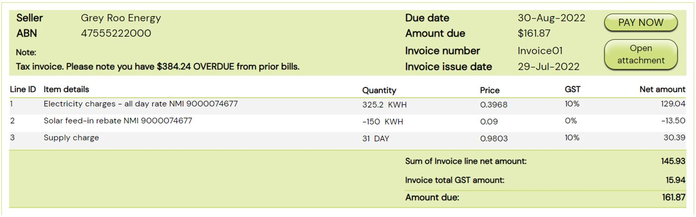
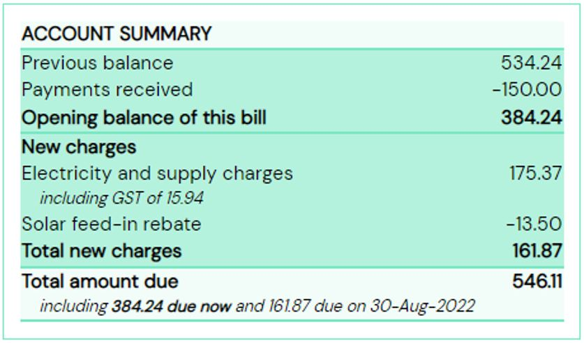
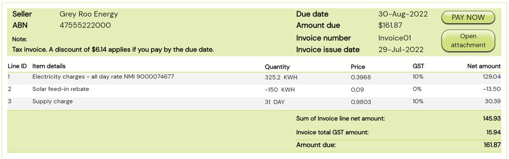
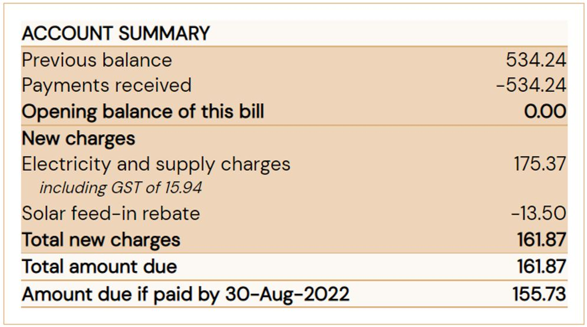

<p align="center">
  
</p>

# A-NZ Industry Practice Statement

# Guidance and implementation options for specific billing scenarios

Version: 1.0

Publication Date: April 2023

📄 Copy available for download [here](Update the link)

Contact the local Peppol Authority for questions or feedback:

- Australia:
  [<u>eInvoicing@ato.gov.au</u>](mailto:eInvoicing@ato.gov.au)

- New Zealand:
  [<u>support@nzpeppol.govt.nz</u>](mailto:support@nzpeppol.govt.nz)

  ---

## Background

eInvoicing is the automated digital exchange of invoice information
between suppliers' and buyers' software (e.g., accounts
payable/receivable solutions, ERP, Financial Management Information
Systems (FMIS) through a secure network.

*More information about eInvoicing can be found at* [*<u>eInvoicing
in</u>* <u>Australia</u>](http://www.ato.gov.au/eInvoicing) and
[<u>eInvoicing in New Zealand.</u>](https://www.einvoicing.govt.nz/)

In Australia, many energy retailers are in the process of updating their
billing solutions for individual and small business customers to meet
the needs of the Australian Energy Regulator’s (AER) Better Bills
Guideline.

As some of those retailers are considering implementing eInvoicing at
the same time, a working group was formed by interested stakeholders
including large businesses (energy retailers and customers), bookkeepers
(representing large and small customers) and software solution
providers, to identify how eInvoicing can support common billing
scenarios.

---

## Purpose

The billing scenarios identified and discussed by the group may be
applicable to different market sectors.

The document summarises the use cases and the considerations for each
implementation option. It aims to support entities and service providers
when considering their own business and regulatory requirements and
determine an optimal solution.

**Scope**

This document discusses billing scenarios and considerations for Peppol
implementations. It *does not* intend to develop segment-specific
invoicing specifications or to dictate specific ‘mapping’ guidance.

For data mapping guidance, please refer to the outcomes of the
[<u>Consistent Data Mapping focus
group</u>](https://www.dspanz.org/committees/peppol/anz-peppol-all-stakeholders-working-group/consistent-data-mapping-focus-group/),
which was co-chaired by the A-NZ Peppol Authorities and DSPANZ.

NOTE: Similar to other industry practice documents that are developed by
the [<u>A-NZ Peppol Stakeholders Working
Group</u>](https://www.dspanz.org/committees/peppol/anz-peppol-all-stakeholders-working-group/attachments/),
this is a living document that may be updated based on feedback and/or
new billing scenarios that are raised.

---

## Useful resources:

- [<u>Sample eInvoices/credit notes for different billing
  scenarios</u>](https://github.com/A-NZ-PEPPOL/A-NZ-PEPPOL-BIS-3.0/tree/master/Message%20examples)

- [<u>A-NZ Peppol Invoice
  Extension</u>](https://github.com/A-NZ-PEPPOL/A-NZ-PEPPOL-BIS-3.0)
  (eInvoice specification)

- [<u>Guidance
  documents</u>](https://github.com/A-NZ-PEPPOL/Guidance-documents) to
  assist with Peppol implementation in A-NZ

- [<u>Consistent data mapping
  guidance</u>](https://github.com/A-NZ-PEPPOL/A-NZ-Industry-Practice-Statements/blob/main/A-NZ%20ASWG_Consistent%20Data%20Mapping%201.0.docx)
  developed by [<u>the A-NZ Peppol Stakeholders Working
  Group</u>](https://www.dspanz.org/committees/peppol/anz-peppol-all-stakeholders-working-group/consistent-data-mapping-focus-group/)

---

## eInvoicing considerations in general 

<u>Varying data capabilities by solutions</u>

The accounts payable/receivable, software solutions have varying
capabilities to store and display data.

For example, accounting software used by small businesses might only
support basic invoicing/finance data and solutions for larger businesses
are usually more sophisticated and support richer data.

<u>Data requirements and existing business processes</u>

Data requirements and processing can also vary depending on customer
business requirements. For example, it is recognised that commercial and
industrial (C&I) customers generally have more complex requirements and
often customised solutions. E.g. large customers commonly require
specific data / attachments to facilitate internal processing, which can
remain the same when using eInvoicing.

Existing business practices should also be considered when implementing
eInvoicing:

- Commonly, large business customers who receive consolidated bills for
  multiple premises or supply addresses require detailed breakdowns of
  costs/charges for each site.

  - These are often provided by suppliers in spreadsheets, customised as
    requested by customers, and can be provided with the bill/invoice
    via email or via a portal.

  - Customers commonly have internal processes to reconcile and verify
    costs using spreadsheets – e.g. upload to internal processing
    systems or use macros before a bill/invoice is approved for payment.
    This process is sometimes undertaken by a third party.

- Customers may use other approaches to manage their bills/invoices, for
  example:

  - Refer to the total payable amount, and only refer to charge details
    if required.

  - Forward bills/invoices to a bookkeeper for processing and entering
    into their accounting systems.

- Customers commonly require ‘additional’ information (i.e., information
  that goes beyond the standard accounting details) to process bills,
  such as specific identifiers, supplier address, and clear descriptions
  of costs, tariffs or credits/adjustments.

- Customers might regularly monitor their consumption of certain
  supplies and rely on graphical trend analysis of historical usage
  included on their bills.

- When product consumption is for a mixture of business and personal
  use, customers will need to allocate the costs accordingly, as they do
  today, through manual adjustments in their systems.

### Recommendations

Considering the above, the following approaches can be considered.

- Where practical, the eInvoice (XML) should include enough detail to
  support more sophisticated customer systems or processing needs.

  - Receiving extra data will not cause invoices to be rejected.
    Customers or receiving systems can ignore the data that is not
    required or unable to be consumed or displayed in the receiver’s
    user interface.

> This may allow suppliers to use the same billing solution (or minimise
> customisation) for different customer cohorts with different and
> changing requirements or solution capabilities. Future changes to
> supplier systems, driven by changing customer requirements and
> evolving/maturing receiving solution capabilities may be mitigated to
> some extent by ‘future proofing’ sending solutions to cater for the
> highest-level receiver requirements from the outset, while ensuring
> key information is included in a way that less sophisticated systems
> can make use of.

- Bills (e.g. PDF) or spreadsheets that are currently available to
  customers can continue to be provided as attachments to the eInvoice.

  - Relevant accounts payable data arrives directly into the receiver’s
    software via the XML part of the eInvoice, facilitating automation
    and removing the need for manual handling, while also providing
    access to necessary supporting information via attachments.

  - This may ease the change management implications and support
    customers to continue using their current processes. For example, a
    large business may need to upload a customised spreadsheet to a
    processing tool; or a small business customer may rely on
    attachments to understand detail such as usage trends to verify the
    cost, and graphs are routinely used to convey information.

  - Bills commonly provide additional information and serve other
    purposes beyond being a payment request, such as providing marketing
    information or critical support information for customers.

  - Some customer accounts payable solutions might not store or display
    all information that the customer requires. For example, solutions
    might not store multiple payment methods and instructions, and
    customers may need to refer to the PDF for payment options.

---

## Use cases

### Use Case 1 – Billing to a third party

#### Description

Customers sometimes use a third-party provider (e.g. a property
management company) to manage bills such as utilities or
telecommunications, and may request their bills issued directly to the
third-party provider.

For example, a customer may ask their supplier to send eInvoices to
their property management company.

[<u>A range of business and technical
identifiers</u>](https://docs.peppol.eu/poacc/billing/3.0/codelist/eas/)
can be used as a Peppol ID (also known as the electronic address or
Endpoint ID). In Australia and New Zealand, ABNs and NZBNs are commonly
used as the Peppol ID; however, entities may use other commercial
identifiers (e.g. Global Location Number (GLN), DUNS Number) as
required.

#### Considerations

The eInvoice allows the buyer’s legal identifier to be different from
the buyer’s ‘endpoint’ identifier/Peppol ID.

Suppliers can use the customer’s third-party provider’s Peppol ID as
advised by the customer/third-party to:

- look up the eInvoicing capability of the third-party provider.

- send eInvoices using that identifier if the third-party provider is
  eInvoicing-enabled.

#### Example 

Buyer’s legal / business identifier may be different from its Endpoint
ID.

```xml
<cac:AccountingCustomerParty> <!-- Buyer/customer details -->
  <cac:Party>
    <cbc:EndpointID schemeID="0151">58725115040</cbc:EndpointID> 
    <!-- Buyer/customer 'Peppol ID' -->
    ...
    <cac:PartyLegalEntity>
      <cbc:RegistrationName>Trotters Incorporated</cbc:RegistrationName>
      <cbc:CompanyID schemeID="0151">91888222000</cbc:CompanyID>
      <!-- Buyer/customer ABN -->
    </cac:PartyLegalEntity>
  </cac:Party>
</cac:AccountingCustomerParty>

```
---

### Use Case 2 – Opening balance in arrears or in credit

#### Description

It is common for bills, e.g. utility bills, to act as both an invoice
and a statement, displaying the running account balance for a customer.
For example, if the customer has an unpaid amount from previous billing
periods, the amount can be displayed in the new bill as ‘overdue’ or
‘amount in arrears’.

Similarly, the account balance may be in credit when a new invoice is
issued.

In this scenario, a bill serves multiple purposes: as a request for
payment as well as a reminder or a notification.

#### Considerations

<u>Payable amount</u>

It is recommended that the data in the XML message of an eInvoice
**should only include new charges (and/or rebates) that are incurred for
the billing period**.

eInvoicing is designed to automate the accounts payable process, and
eInvoice data is expected to be processed directly into a customer’s
accounts payable solution.

Including previously invoiced amounts (positive or negative) into the
new total amount will effectively duplicate payable amounts in the
customer’s accounting software and the accumulated net balance to the
supplier will be incorrect.

Software solutions, including those used by small businesses, generally
can show the total debt owing / credit to suppliers, based on payments
recorded against past and current bills, and assist businesses to manage
payments and cash flow.

An attachment (e.g. PDF bill) can continue to serve multiple purposes
such as showing overdue amounts or the opening balance of an account
being in credit and providing the account balance after the new charges
and rebates.

The total of new charges and rebates for the period may result in a
negative invoice total amount that will be included in the XML data.

<u>Reminders for overdue payments</u>

There are other channels to remind a customer of amounts owing. For
example:

- In the eInvoice XML data, a reminder can be included as free text
  (e.g. in the *Note* field), which may be displayed to customers in
  their software UI (depending on customers’ solution capabilities).

- An attachment (e.g. PDF bill) can continue to display the account
  balance, including the carried over amount.

- Suppliers can continue to use existing channels such as portals or SMS
  messages to send reminders.

<u>User experience</u>

eInvoicing may change the user experience, in that the amount in the
eInvoice (new charges) may be different from the total payable amount in
the attachment (e.g. PDF bill which may include overdue amounts).

As with all changes to billing, these may be considerations when
planning change management activities, including messaging and
layout/content of the attached PDF bill and other communication
channels.

#### Example

If an eInvoice includes *new* electricity and supply charges of
AUD\$159.43 (plus 10% GST) and solar rebate of AUD\$13.50 (no GST in
this example – e.g. a micro business not required to be registered), the
eInvoice XML could include these amounts:

```xml

  <!-- Invoice Totals: -->
  <cbc:TaxAmount currencyID="AUD">15.94</cbc:TaxAmount>
  <cbc:LineExtensionAmount currencyID="AUD">145.93</cbc:LineExtensionAmount>
  <cbc:TaxExclusiveAmount currencyID="AUD">145.93</cbc:TaxExclusiveAmount>
  <cbc:TaxInclusiveAmount currencyID="AUD">161.87</cbc:TaxInclusiveAmount>
  <cbc:PayableAmount currencyID="AUD">161.87</cbc:PayableAmount>

  <!-- Invoice Lines: -->
    <cbc:ID>1</cbc:ID> <!-- Line with 10% GST -->
    <cbc:LineExtensionAmount currencyID="AUD">129.04</cbc:LineExtensionAmount>
    <cbc:Name>Electricity charges - all day rate NMI 9000074677</cbc:Name>

    <cbc:ID>2</cbc:ID> <!-- Line with zero GST -->
    <cbc:LineExtensionAmount currencyID="AUD">-13.50</cbc:LineExtensionAmount>
    <cbc:Name>Solar feed-in rebate NMI 9000074677</cbc:Name>

    <cbc:ID>3</cbc:ID> <!-- Line with 10% GST -->
    <cbc:LineExtensionAmount currencyID="AUD">30.39</cbc:LineExtensionAmount>
    <cbc:Name>Supply charge</cbc:Name>
```

Full xml example [<u>available
here</u>](https://github.com/A-NZ-PEPPOL/A-NZ-PEPPOL-BIS-3.0/blob/master/Message%20examples/AU%20Invoice%20Energy%20Bill%20Example_1.xml).

The above eInvoice might be displayed in the buyer’s software UI as
follows (noting the *Amount due* and the optional *Note*):



The attached PDF bill might display amounts in the form of an account
statement that could look like:



---

### Use Case 3 – Conditional discount

#### Description

Some providers offer conditional discounts such as a ‘pay-on-time’
discount.

For example, a new charge of \$100 has been incurred for the billing
period. The invoice shows a total payable amount of \$100, with a
conditional discount of \$10 if payment is made by the due date (i.e.
total payable amount would be \$90 if paid on time).

#### Considerations

<u>Payable amount</u>

The eInvoice XML data can only convey one payable amount and most
accounting systems are not sophisticated enough to support multiple
invoice total due amounts based on conditions.

The total payable amount in the XML data must therefore either be the:

- Non-discounted amount

  - If the customer meets the conditions (e.g. pays on time), they can
    receive a credit on their next bill

  - The *Note* (free text field) can be used to explain the discount

- Discounted amount

  - If the customer does not meet the conditions (e.g. does not pay on
    time), they can receive an extra charge on their next bill

#### Example

If the bill includes electricity and supply charges of AUD\$175.37
(\$159.43 plus \$15.94 GST) and solar rebate of AUD\$13.50 (no GST in
this example), and a possible discount of 3.5% of \$175.37 = \$6.14
(calculated on the charges excluding the solar rebate), the eInvoice XML
could include these amounts as follows:

```xml

<!-- Invoice Totals -->
<cbc:TaxAmount currencyID="AUD">15.94</cbc:TaxAmount>
<cbc:LineExtensionAmount currencyID="AUD">145.93</cbc:LineExtensionAmount>
<cbc:TaxExclusiveAmount currencyID="AUD">145.93</cbc:TaxExclusiveAmount>
<cbc:TaxInclusiveAmount currencyID="AUD">161.87</cbc:TaxInclusiveAmount>
<cbc:PayableAmount currencyID="AUD">161.87</cbc:PayableAmount>

<!-- Invoice Lines -->
<cbc:ID>1</cbc:ID> <!-- Line with 10% GST -->
<cbc:LineExtensionAmount currencyID="AUD">129.04</cbc:LineExtensionAmount>
<cbc:Name>Electricity charges - all day rate NMI 9000074677</cbc:Name>

<cbc:ID>2</cbc:ID> <!-- Line with zero GST -->
<cbc:LineExtensionAmount currencyID="AUD">-13.50</cbc:LineExtensionAmount>
<cbc:Name>Solar feed-in rebate NMI 9000074677</cbc:Name>

<cbc:ID>3</cbc:ID> <!-- Line with 10% GST -->
<cbc:LineExtensionAmount currencyID="AUD">30.39</cbc:LineExtensionAmount>
<cbc:Name>Supply charge</cbc:Name>
```
Full xml example [<u>available
here</u>](https://github.com/A-NZ-PEPPOL/A-NZ-PEPPOL-BIS-3.0/blob/master/Message%20examples/AU%20Invoice%20Energy%20Bill%20Example_2.xml).

Which might be displayed in the buyer’s software UI as follows (noting
the *Amount due* and the optional *Note*):



For comparison, the attached PDF bill might display two ‘amount due’
values that could look like:



---

### Use Case 4 – Consolidated invoices

#### Description

The term ‘consolidated invoice’ commonly refers to the scenario when
charges for multiple branches (e.g. locations or meters) are ‘bundled’
into one bill.

This can apply to business entities that have multiple office locations,
or property management companies that receive bundled bills for multiple
shops in a shopping complex.

#### Considerations

An eInvoice can include multiple invoice lines, therefore this scenario
does not bring additional challenges for conveying data.

Customers that manage consolidated bills commonly rely on an attachment
to allocate costs. As indicated above, the attachments (e.g. PDF bills
and/or spreadsheets) that are currently available to customers can be
provided as attachments to the eInvoice, to support customers’ existing
systems and processes.

Some suppliers and customers may use the automation benefits of
eInvoicing as a catalyst to reconsider their business processes, e.g.
may change to send multiple separate invoices if that will assist in
reducing manual handling or optimise automated processing.

---

### Use Case 5 – Adjusting a previous bill

Suppliers sometimes need to adjust or cancel a previous bill and
re-issue a new bill, for example for utility bills when revised meter
data is received after a bill is issued based on estimation.

#### Considerations

Similar to current billing processes, suppliers may choose to issue an
adjustment or cancellation invoice as a new eInvoice transaction. The
new transaction can be a negative invoice or a credit note to cancel or
adjust the net payable amount, or potentially be a new invoice to
replace the previously issued and cancelled invoice.

Alternatively, depending on the supplier’s processes and systems, the
credit amount may be included as an invoice line on a subsequent
invoice.

There are different ways to indicate a bill is an adjustment or
cancellation, e.g. the PDF may have the word “adjustment” on the front
page, and an adjustment is likely to reference the invoice number of the
bill that is being adjusted.

In a Peppol eInvoice (or credit note),

- the field `cac:BillingReference` can be used to reference the previous
  bill number;

- The free text field `cbc:Note` (invoice level) or line descriptions
  `cac:InvoiceLine/cac:Item/cbc:Name` can indicate a previous bill / item
  is being adjusted.

Please note customer solutions may have various capabilities to
receive/display data, and some solutions may not be able to display the
previous invoice number (`cac:BillingReference`), in which case customers
can refer to the attached PDF.

<u>Additional information about negative invoices, invoices with zero
total and credit notes</u>

Peppol supports both credit notes and invoices with positive or
negative, or zero amounts.

Negative invoices and credit notes can serve the same business purpose
to inform a customer of a credit being applied to their account.
Suppliers and customers may have a specific agreement to use one
transaction type or both.

Please note: Credit Note and Invoice (positive or negative) are separate
transaction types in Peppol, although they are almost identical, with
just the amounts reversed (negative amounts in an Invoice are equivalent
to positive amounts on a Credit Note).

See examples of a Peppol [<u>credit
note</u>](https://github.com/A-NZ-PEPPOL/A-NZ-PEPPOL-BIS-3.0/blob/master/Message%20examples/AU%20Credit_note.xml)
and a [<u>negative
invoice</u>](https://github.com/A-NZ-PEPPOL/A-NZ-PEPPOL-BIS-3.0/blob/master/Message%20examples/AU%20Invoice%20Energy%20Bill%20Example_3_negative_inv.xml).
The examples effectively convey the same business information.

Some customer solutions may only support Invoices and not Credit Notes
and this capability is ‘advertised’ by the customer’s Peppol providers.
Billers can therefore take this into consideration when choosing the
appropriate Peppol transaction that the customer (and their systems) can
receive.

---

### Use Case 6: Payment arrangements

A customer and supplier can agree on a payment / instalment plan outside
of Peppol.

A bill may include specific payment options or details on an agreed
arrangement, e.g. a customer is on an instalment plan.

#### Considerations

Peppol eInvoicing is not intended to change the current business process
or preferred payment options. Depending on the agreement and supplier’s
existing processes and systems:

- Based on an agreement, a supplier may send multiple bills, each
  including the agreed ‘split/instalment amount’ and/or adjustment to
  reflect actual usage etc. In this scenario, the customer will receive
  multiple eInvoices for a billing period;

- Alternatively, a common practice is to send a single invoice with
  flexible payment arrangements available, and a customer can choose to
  pay instalments at their own discretion. 

Consider the varying data capabilities of the receiving solution (i.e.
some solutions may not be able to display the full eInvoice/UBL
message), suppliers should consider the following to ensure customers
have access to the information to choose a suitable option:

- the payment options/instructions should be included in the attached
  PDF; or

- the payment options/instructions can also be included in `cbc:Note`
  (free text), which a customer may be able to view via their solution
  UI.

---

## Version Control

|  |  |  |
|----|----|----|
| **Version** | **Date** | **Note** |
| Initial draft | December 2022 | Initial draft |
| 1.0 | April 2023 | Incorporated feedback from the A-NZ Peppol Stakeholders Working Group (ASWG). |
